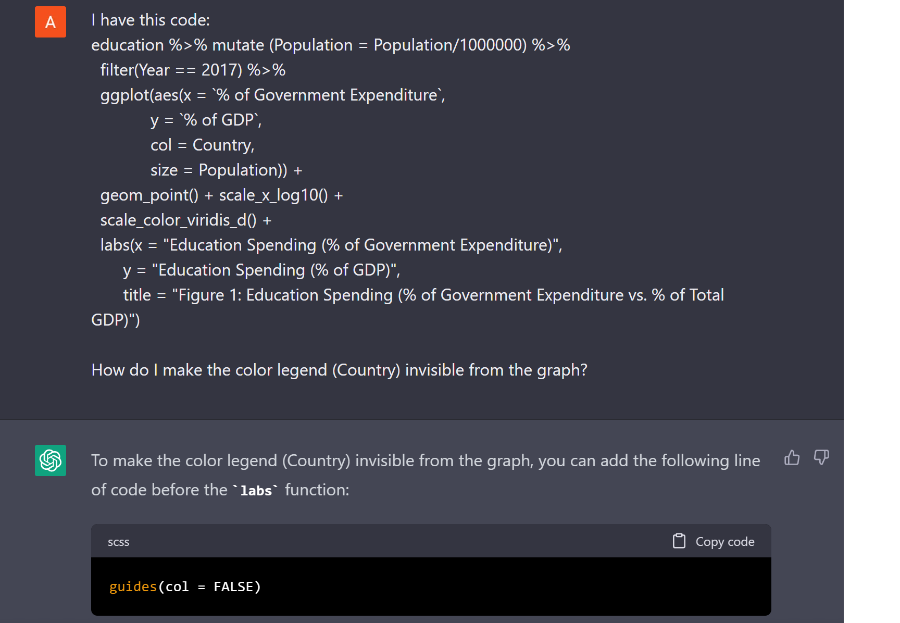

```{r  libraries, message = FALSE, warning = FALSE, eval = TRUE, echo = FALSE}

library(rmarkdown)
library(knitr)
library(tidyverse)
library(readr)
library(kableExtra)
library(ggplot2)
library(dplyr)
library(bookdown)

```

```{r setup, include=FALSE}
knitr::opts_chunk$set(echo = TRUE,
                      message = FALSE,
                      warning = FALSE,
                      fig.align = "center",
                      fig.path = "Figures/")

```


# **Introduction**
We are going to research about public expenditure on education and how this differs among various countries. Reason being, education is considered as a fundamental human right, with governments being expected to provide accessible education for their citizens. Education is also a key driver of economic growth and development; however, education inequality is still prevalent among countries, which can be partly attributed to some countries investing significantly more in education than others. 

By understanding the disparities in education spending between different countries, we can identify gaps in education funding and pinpoint areas where additional resources may be needed (e.g. advocacy efforts, targeted investments such as early childhood education/teacher training). 

# **Research Question** 
The specific question we would like to investigate is how does a country's spending on education as a share of government expenditure and GDP relate to its population size? By understanding how significantly population size influences public expenditure on education, this can help provide insights to policymakers on resource allocation strategies. 

We can also better understand the relationship between education spending and education quality; for instance, if we find that governments of larger countries spend a large proportion of both their budgets and GDP on education, we can infer that population size may be correlated with education prioritization decisions and as a result, education quality. 

# **Data Set Introduction** 
The dataset renamed as ["education"](https://ourworldindata.org/grapher/share-edu-spending-gdp-vs-share-edu-total-spending) provides an overall measure of different countries' government expenditure on education, both expressed as a percentage of total government expenditure on all sectors and as a percentage of total GDP. The dataset also includes each respective country's population size (historical estimates). 

The variable time spans initially covered 1970 – 2020 data; however, it should be noted that there are missing data in certain years for some countries which poses a limitation to our analysis. After accounting for this limitation by filtering out the missing values, the resulting dataframe covers data from 1980-2018. 

Variable types and characteristics can be further observed in Table \@ref(tab:table1) below. 

```{r  reading data, message = FALSE, warning = FALSE, eval = TRUE, echo = TRUE}
education <- read_csv("data/educationspending.csv")
```

```{r  cleaning data, message = FALSE, warning = FALSE, eval = TRUE, echo = TRUE}
education <- education %>% 
  rename(Country = Entity,
        `% of Government Expenditure` = `Share of education in government expenditure (% of government expenditure) (World Bank (2019))`,
        `% of GDP` = `Government expenditure on education, total (% of GDP)`, 
         Population = `Population (historical estimates)`) %>%
  filter(!is.na(`% of Government Expenditure`)) %>%
  filter(!is.na(`% of GDP`)) %>%
  filter(Country != "World") %>%
  dplyr::select(Country, Code, Year, `% of Government Expenditure`, `% of GDP`, Population, Continent)

```

```{r table1, message = FALSE, warning = FALSE, eval = TRUE, echo = TRUE}
education %>%
  summary() %>%
  kable(booktabs = TRUE, 
        caption = "Education Spending between Countries of Different Population Sizes (measured as % of Government Expenditure and % of GDP) from the years 1980-2018. Smallest population size of a country over the years is approximately 19740 with largest population size being 1.29 billion.") %>%
  kable_styling(bootstrap_options = c("striped", "hover"))

```


# **Data Set Description Subsection**

```{r  subsection, message = FALSE, warning = FALSE, eval = TRUE, echo = TRUE}

print(paste("The `education` data frame has", dim(education)[1], "observations and", dim(education)[2], "variables."))
      
```

```{r subsectionimage, message = FALSE, warning = FALSE, eval = TRUE, echo = TRUE, fig.cap = "the code used to display the number of observations and variables in the `education` dataset: dim(education)[1] retrieves the number of rows (observations) whereas dim(education)[2] retrieves the number of columns (variables)."}


```

Variable types can be seen below as well:

```{r  variables, message = FALSE, warning = FALSE, eval = TRUE, echo = TRUE}
head(education, 2)
```

# **Results**

```{r figure1, message = FALSE, warning = FALSE, eval = TRUE, echo = TRUE, fig.cap = "Education Spending (% of Government Expenditure vs. % of Total GDP) between countries of different population sizes"}

education %>% 
  mutate (Population = Population/1000000) %>%
  filter(Year >= 2016 & Year <2018) %>%
  ggplot(aes(x = `% of Government Expenditure`,
             y = `% of GDP`, 
             col = Country,
             size = Population)) +
  geom_point() +
  scale_color_viridis_d() +
  labs(x = "Education Spending (% of Government Expenditure)",
       y = "Education Spending (% of GDP)") +
  guides(color = FALSE) +
  facet_wrap(~Year, ncol = 2)

```

- *In Figure \@ref(fig:figure1) (using 2016 and 2017 as base years), we can see there is a positive correlation for both years: this infers that countries which spend a large share of their income on education also have higher education prioritization within government budgets as well.*

- *However, there is no obvious pattern between population sizes and countries' education prioritization. Some larger countries spend a smaller budget share on education than other smaller countries (and vice versa), indicating that population size may not be a major factor in determining education spending and other factors (such as overall economic growth/development) may have a higher influence.*  


```{r figure2, message = FALSE, warning = FALSE, eval = TRUE, echo = TRUE, fig.cap = "Distribution of Education Spending grouped by population sizes (2017)"}

education %>% filter(Year == 2017) %>%
  mutate (Population = Population/1000000) %>%
  mutate(Population_Group = cut(Population, breaks = c(0, 10, 50, Inf),
                                labels = c("Small", "Medium", "Large"))) %>%
  ggplot(aes(x = Population_Group,
             y = `% of Government Expenditure`, 
             fill = Population_Group)) +
geom_boxplot() +
  scale_fill_brewer(palette = "Set2") + 
  labs(x = "Population Size",
       y = "Education Spending (% of Government Expenditure)") 

```

- *In Figure \@ref(fig:figure2) (using 2017 as a base year) on average, countries with larger populations tend to spend a smaller proportion of their government expenditure on education, whereas smaller countries allocate a higher proportion of their government budget on education (due to the "small population" country group having the highest median).* 

- *However, it should be noted there is also high variability in the box plot above, with some countries spending much more or much less than the median. This means education spending as a percentage of total government expenditure still varies widely among countries even within the same population size group.* 


# **Conclusion**

Overall, we can conclude that population size alone may not be a major determining factor in education spending decisions by governments. There could be other factors involved such as level of economic development/economic conditions, available resources, government priorities/political goals, other demographic variables (e.g. age structure), education system structures and more which have a greater influence over education spending. 

For instance, we observed from Figure \@ref(fig:figure1) that countries which spend a high proportion of their income on education also have education taking up a large proportion of their government budgets; this infers a possible linear relationship between higher-income countries and education spending. Hence, it would be interesting to research further into what else potentially influences public spending on education and their level of significance.

# **Appendix**

### Figure 1: Using ChatGPT to Enhance Existing Code

```{r  appendix, message = FALSE, warning = FALSE, eval = TRUE, echo = FALSE}


```